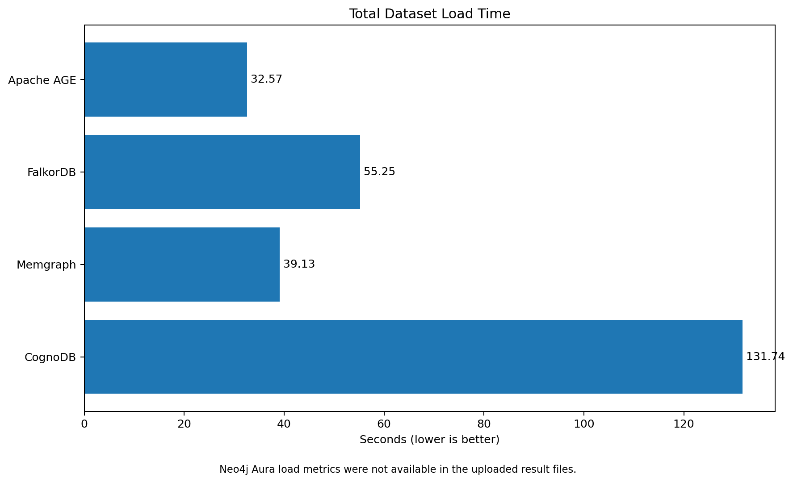
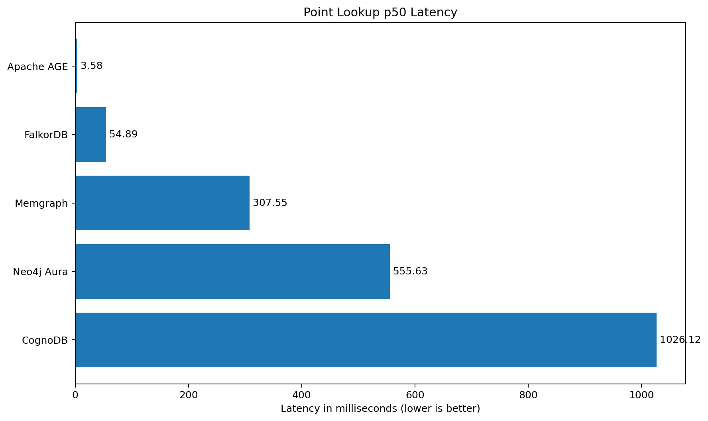
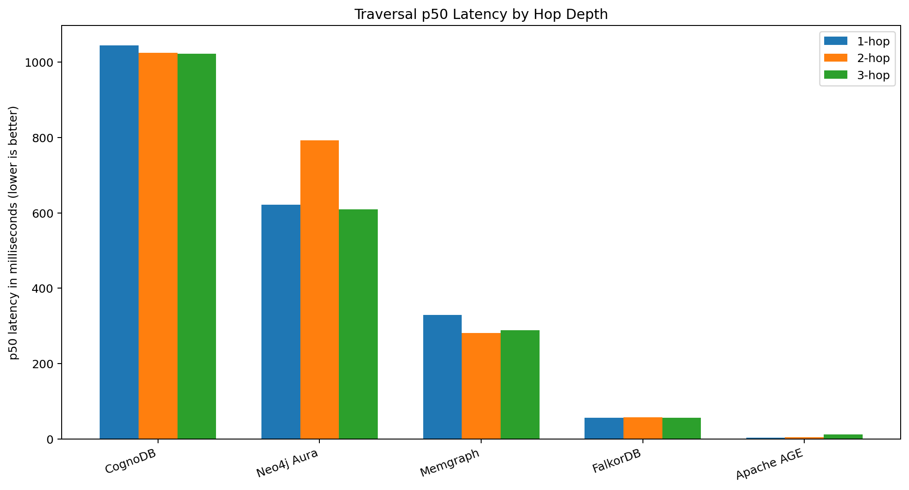
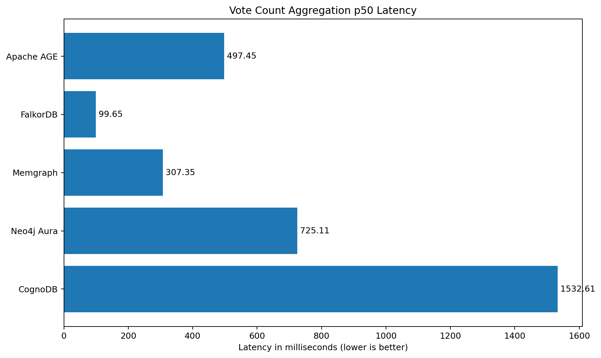
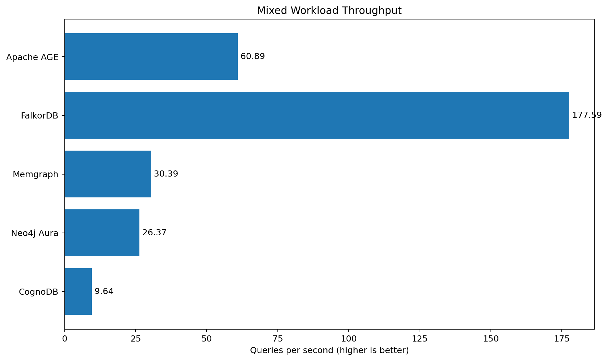

# Graph Database Benchmark Framework

A reproducible Node.js benchmark suite comparing ****CognoDB Cloud**** with four other graph database platforms using the same public dataset and the same logical workloads.

## Databases Compared

- CognoDB Cloud
- Neo4j AuraDB
- Memgraph Cloud
- FalkorDB Cloud
- Apache AGE on PostgreSQL in Docker

## Dataset

This project uses the ****SNAP Wiki-Vote**** directed graph dataset.

- Source: Stanford Network Analysis Project
- Dataset page: https://snap.stanford.edu/data/wiki-Vote.html
- Nodes: ****7,115****
- Relationships: ****103,689****
- Relationship meaning: `A -> B` means Wikipedia user A voted for user B to become an administrator
- Graph model:
  - Node label: `User`
  - Node property: `id`
  - Relationship type: `VOTED_FOR`

The same dataset was loaded into every platform.

## Benchmark Workloads

Each read workload uses:

- 20 warm-up iterations
- 100 measured iterations
- random start-node selection where applicable
- client-observed wall-clock latency
- p50, p95, average, minimum, and maximum latency

The workloads are:

1\. Point lookup by `User.id`
2\. Indexed/filtered range lookup
3\. 1-hop traversal
4\. 2-hop traversal
5\. 3-hop traversal
6\. Vote-count aggregation
7\. Mixed workload with:
   - 10 concurrent clients
   - 30-second duration
   - 90% reads
   - 10% writes

## Project Architecture

```text
SNAP Wiki-Vote dataset
        |
        v
Dataset parser and batch loader
        |
        +-----------------------------+
        |             |               |
        v             v               v
 Neo4j driver     FalkorDB client   PostgreSQL pg client
        |             |               |
        v             v               v
CognoDB / Neo4j /  FalkorDB       Apache AGE
Memgraph
        |
        v
Shared benchmark runner
        |
        v
Statistics: average, p50, p95, min, max, QPS
        |
        v
JSON result files
```

## Technology Stack

- Node.js
- JavaScript ES modules
- `neo4j-driver`
- `falkordb`
- `pg`
- `dotenv`
- Docker Desktop for Apache AGE

## Installation

```bash
git clone https://github.com/RadhaNinave/graph-database-benchmark.git
cd graph-database-benchmark
npm install
```

The project was executed with the dependency versions pinned in `package-lock.json`.

## Environment Variables

Create a local `.env` file based on `.env.example`.

Never commit real passwords or production connection URIs.

```env
# CognoDB
COGNODB_URI=bolt+s://your-cognodb-host
COGNODB_USERNAME=cognodb
COGNODB_PASSWORD=your-password
COGNODB_DATABASE=

# Neo4j Aura
NEO4J_URI=neo4j+s://your-instance.databases.neo4j.io
NEO4J_USERNAME=neo4j
NEO4J_PASSWORD=your-password
NEO4J_DATABASE=neo4j

# Memgraph Cloud
MEMGRAPH_URI=bolt+ssc://your-memgraph-host:7687
MEMGRAPH_USERNAME=your-username
MEMGRAPH_PASSWORD=your-password

# FalkorDB Cloud
FALKORDB_HOST=your-host
FALKORDB_PORT=your-port
FALKORDB_USERNAME=falkordb
FALKORDB_PASSWORD=your-password
FALKORDB_GRAPH=wiki_vote
FALKORDB_TLS=false

# Apache AGE
AGE_HOST=localhost
AGE_PORT=5455
AGE_DATABASE=benchmark
AGE_USER=postgres
AGE_PASSWORD=your-password
AGE_GRAPH=wiki_vote
```

## Connection Tests

```bash
npm run test:connection
npm run test:neo4j
npm run test:memgraph
npm run test:falkordb
npm run test:age
```

## Loading the Dataset

```bash
npm run load:cognodb
npm run load:neo4j
npm run load:memgraph
npm run load:falkordb
npm run load:age
```

### Load Methods

| Platform | Load method |
|---|---|
| CognoDB | Neo4j driver with batched `UNWIND` Cypher queries |
| Neo4j Aura | Neo4j driver with batched `UNWIND` Cypher queries |
| Memgraph | Neo4j driver using auto-commit sessions and batched `UNWIND` |
| FalkorDB | Official FalkorDB Node.js client with batched Cypher queries |
| Apache AGE | PostgreSQL `pg` client calling AGE Cypher with batched literal lists |

## Running Read Benchmarks

```bash
npm run benchmark:cognodb
npm run benchmark:neo4j
npm run benchmark:memgraph
npm run benchmark:falkordb
npm run benchmark:age
```

## Running Mixed Workloads

```bash
npm run benchmark:cognodb:mixed
npm run benchmark:neo4j:mixed
npm run benchmark:memgraph:mixed
npm run benchmark:falkordb:mixed
npm run benchmark:age:mixed
```

Results are written as timestamped JSON files in `results/`.

## Instance and Environment Details

These are the actual tiers and locations used during this run.

| Platform | Deployment | Region | CPU | RAM | Storage / dataset limit |
|---|---|---|---:|---:|---|
| CognoDB | Free c0 cloud instance | `us-east4` | burst up to 0.5 vCPU | 512 MB shown in dashboard | 1 GiB |
| Neo4j Aura | AuraDB Free | Not recorded | Not exposed | Not exposed | Free-tier limits |
| Memgraph | 14-day cloud trial | US East (Ohio) | 2 CPU | 2 GB | Not recorded |
| FalkorDB | Free cloud deployment | AWS `ap-south-1` | Not exposed | 100 MB free-tier limit | 100 MB maximum graph dataset |
| Apache AGE | Local Docker container | Local client machine, India | capped at 0.5 CPU | capped at 512 MB | local Docker storage |

## Data Loading Results

| Platform | Nodes/s | Relationships/s | Node load (s) | Relationship load (s) | Total load (s) |
|---|---:|---:|---:|---:|---:|
| CognoDB | 763.23 | 872.23 | 9.32 | 118.88 | 131.74 |
| Neo4j Aura | 4,008.13 | 3,744.48 | 1.78 | 27.69 | 33.74 |
| Memgraph | 2,462.97 | 2,942.65 | 2.89 | 35.24 | 39.13 |
| FalkorDB | 2,711.18 | 1,981.93 | 2.62 | 52.32 | 55.25 |
| Apache AGE | 50,931.77 | 3,279.67 | 0.14 | 31.62 | 32.57 |


## Read Benchmark Results — p50 Latency

Lower is better.

| Platform | Point lookup | Indexed range | 1-hop | 2-hop | 3-hop | Aggregation |
|---|---:|---:|---:|---:|---:|---:|
| CognoDB | 1026.115 | 1056.945 | 1044.773 | 1025.021 | 1022.516 | 1532.609 |
| Neo4j Aura | 555.626 | 509.648 | 621.574 | 793.035 | 609.057 | 725.105 |
| Memgraph | 307.546 | 308.131 | 329.417 | 281.192 | 287.857 | 307.350 |
| FalkorDB | 54.886 | 61.520 | 56.436 | 57.027 | 55.730 | 99.652 |
| Apache AGE | 3.578 | 6.151 | 2.796 | 3.929 | 11.831 | 497.447 |

All values are milliseconds.

## Read Benchmark Results — p95 Latency

Lower is better.

| Platform | Point lookup | Indexed range | 1-hop | 2-hop | 3-hop | Aggregation |
|---|---:|---:|---:|---:|---:|---:|
| CognoDB | 1224.094 | 1228.511 | 1232.745 | 1227.986 | 1837.853 | 1844.432 |
| Neo4j Aura | 920.532 | 726.864 | 2931.009 | 2449.825 | 1711.914 | 2006.766 |
| Memgraph | 463.319 | 462.957 | 440.499 | 513.795 | 456.733 | 431.922 |
| FalkorDB | 77.791 | 160.108 | 67.301 | 70.800 | 93.512 | 155.085 |
| Apache AGE | 35.062 | 52.694 | 7.676 | 50.504 | 202.203 | 583.118 |

All values are milliseconds.

## Mixed Workload Results

Higher QPS is better; lower latency is better.

| Platform | QPS | p50 (ms) | p95 (ms) | Average (ms) | Total operations | Failed |
|---|---:|---:|---:|---:|---:|---:|
| CognoDB | 9.64 | 941.202 | 1378.640 | 1035.210 | 298 | 0 |
| Neo4j Aura | 26.37 | 325.212 | 664.062 | 378.145 | 799 | 0 |
| Memgraph | 30.39 | 305.157 | 415.203 | 328.995 | 920 | 0 |
| FalkorDB | 177.59 | 51.959 | 92.054 | 56.294 | 5,330 | 0 |
| Apache AGE | 60.89 | 190.157 | 302.001 | 160.583 | 1,841 | 0 |

Configuration for every mixed run:

- 10 concurrent clients
- 30-second requested duration
- 90% point reads
- 10% temporary property updates
- write property removed after the run


## Benchmark Charts

### Total Dataset Load Time



### Point Lookup p50 Latency



### Traversal p50 Latency



### Vote Count Aggregation p50 Latency



### Mixed Workload Throughput



## Analysis

### Data loading

Apache AGE produced the shortest observed total load time at 32.57 seconds, followed closely by Neo4j Aura at 33.74 seconds, Memgraph at 39.13 seconds, FalkorDB at 55.25 seconds, and CognoDB at 131.74 seconds. Apache AGE ran locally and therefore avoided internet round trips, so its ingestion measurements should not be interpreted as a direct managed-cloud victory.

CognoDB had the slowest observed load in this run. The small free c0 tier and remote round trips likely contributed, but the benchmark does not isolate server execution from network latency.

### Read latency

FalkorDB produced the lowest observed remote-cloud latency in this run. It was deployed in AWS `ap-south-1`, geographically much closer to the benchmark client in India than the US-hosted CognoDB and Memgraph instances. This region advantage is a major confounding variable.

Apache AGE produced very low point and shallow-traversal latency because it ran locally. Its 3-hop latency and aggregation latency increased sharply, showing that workload shape still matters even when network latency is nearly removed.

### Mixed workload

FalkorDB achieved the highest observed mixed-workload throughput. Apache AGE was second, but it ran locally. Memgraph processed more operations than CognoDB during the same 30-second, 10-client workload.

All recorded mixed workloads completed with zero failed operations.

### Aggregation

Apache AGE's aggregation was much slower than its point and traversal workloads. This query scans and groups relationships across much of the graph, then sorts the grouped counts. FalkorDB and Memgraph showed lower observed aggregation latency for this workload.

## Fairness and Limitations

This benchmark is reproducible but ****not perfectly hardware- or network-normalized****.

Important caveats:

1\. The databases did not expose identical free tiers.
2\. Memgraph's trial had more CPU and RAM than CognoDB.
3\. FalkorDB ran in `ap-south-1`, closer to the client than the US-hosted platforms.
4\. Apache AGE ran locally, removing internet latency.
5\. The timings measure end-to-end latency from the Node.js client, not server-only execution time.
6\. Cloud free tiers may throttle, sleep, or experience shared-infrastructure variance.
7\. A single benchmark run cannot measure long-term variance.
8\. Apache AGE used a local Docker deployment capped at 0.5 CPU and 512 MB RAM, but this does not make its network conditions equivalent to cloud services.
9\. The `User.id` lookup path must be checked carefully per platform. The current AGE implementation should not be described as indexed unless a confirmed AGE/PostgreSQL index was created and verified.

The results therefore describe the ****observed behavior of these exact deployments****, not an absolute ranking of database engines.

## Repository Structure

```text
.
├── data/
│   └── Wiki-Vote.txt
├── results/
│   └── timestamped JSON benchmark outputs
├── src/
│   ├── benchmarks/
│   │   ├── benchmarkQueries.js
│   │   ├── benchmarkRunner.js
│   │   ├── runDatabaseBenchmarks.js
│   │   ├── runMixedWorkload.js
│   │   ├── runFalkorDBBenchmarks.js
│   │   ├── runFalkorDBMixedWorkload.js
│   │   ├── benchmarkAgeQueries.js
│   │   ├── runAgeBenchmarks.js
│   │   └── runAgeMixedWorkload.js
│   ├── config/
│   │   ├── databases.js
│   │   └── age.js
│   ├── loaders/
│   │   ├── loadDatabase.js
│   │   ├── loadFalkorDB.js
│   │   └── loadAgeDatabase.js
│   ├── utils/
│   │   └── statistics.js
│   ├── testConnection.js
│   ├── testNeo4jConnection.js
│   ├── testMemgraphConnection.js
│   ├── testFalkorDBConnection.js
│   └── testAgeConnection.js
├── .env.example
├── .gitignore
├── package.json
├── package-lock.json
└── README.md
```

## Key Design Decisions

### Batched loading

Sending one request per node or relationship would cause excessive network round trips. The loaders therefore group records into batches and insert them with `UNWIND` or equivalent Cypher.

### Warm-up iterations

Warm-up queries allow connection setup, query planning, and cache initialization to occur before measured iterations.

### Percentiles

Average latency alone can hide slow outliers. p50 shows the typical request, while p95 shows the slower end of the normal distribution.

### Random start nodes

Traversal costs depend strongly on node degree. Selecting random start nodes avoids measuring only one convenient graph location.

### Separate adapters

CognoDB, Neo4j, and Memgraph share the Neo4j Bolt driver. FalkorDB uses its official Redis-compatible client. Apache AGE runs Cypher through PostgreSQL, so it uses `pg`.

## Future Improvements

- Run each complete benchmark suite at least three times.
- Report mean and standard deviation across runs.
- Add mixed-workload concurrency sweeps at 1, 10, and 40 clients.
- Place all remote databases in the same region.
- Use equivalent paid or self-hosted resource limits.
- Add verified platform-specific index creation and query-plan evidence.
- Collect server-side CPU, memory, storage, and query execution metrics.
- Add automated charts generated from the JSON result files.
- Add a single orchestration command that runs load, reads, and mixed workloads.

## Security

- Credentials are read from environment variables.
- `.env` must remain excluded by `.gitignore`.
- `.env.example` contains placeholders only.
- Never commit connection passwords or private database URIs.

## Author

****Radha Ninave****

GitHub: https://github.com/RadhaNinave
